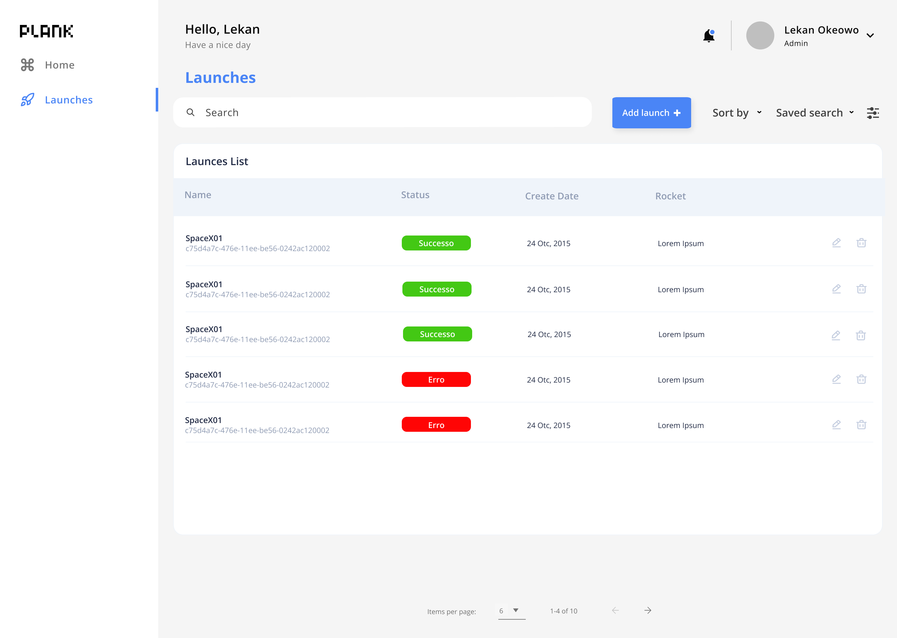

# Desired Technologies
* Typescript
* Javascript
* React
* NodeJS
* NoSQL
* Express
* TypeORM
* Jest
* React Testing Library

# Proposal Layout

The proposal layout can be found on this link: [Figma](https://www.figma.com/file/B6IU7ohFxykNFUzK406hGc/Plank---Launches?type=design&node-id=0%3A1&mode=design&t=ZNeBYFnbmkpHV5aa-1)

The skeleton of the components is already created, you can use it as a base to start the project.

# Backend/Frontend Launches

Create a frontend UI that displays a list of all rockets launches.
You can fetch the launch data at the endpoint that you will create in the backend project.

* Backend: The tasks are specified in the code. Search for #TASK-BACKEND- 0, 1, 2, 3, and 4. You can go in any order to solve the problems.
* Frontend: The tasks are specified in the code. Search for #TASK-FRONTEND - 00, 01, 02, 03, and 04. You can go in any order to solve the problems.
* Bonus: add a date filter to allow users to select a date and only show rocketss launched after that date
* Bonus: add a checkbox to allow users to select only successful launches
* Bonus: add integration with the search service to allow users to search for a launch by name
* Bonus(advanced): Solution to demonstrate the endpoints contracts
* Bonus(advanced): demonstrate a e2e test
* Bonus(advanced): Create a unit test

### In README you can add a description of things that you won't have a chance to finish like:

* How would you think of documentation
* What about CI / CD setup
* How could the directory structure evolve if this was to become a more complex project (Models of Architectures)
* Any other best practices you would want to add